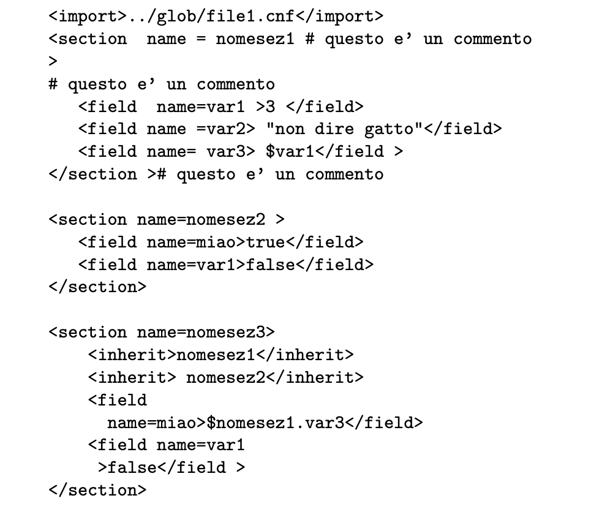

# parte-1-progetto-linguaggi

Checklist delle cose da fare:

- [ ] Definire la grammatica della sintassi; 
- [ ] Implementare un parser e relativo lexer; 
	- [ ] struttura dati contenete i valori associati ad ogni variabile; 
		- [ ] funzioni di costruzione per il parser; 
		- [ ] funzioni di cancellazione di una sezione; 
		- [ ] funzioni di binding singolo; 
- [ ] Implementare pretty-printing; 
- [ ] Predisporre test case ; 
- [ ] Definire descrizione sintetica della soluzione; 
- [ ] Fornire MakeFile; 

# Sintassi 
Il file è composto da una sequenza di sezioni identificate dal tag **section** il cui nome è dato dall'attributo **name**.
Ogni sezione contiene più tag **field** che assegnano valori a variabili indicate da **name**.
Etichette e variabili sono stringhe alfanumeriche, valori sono interi, bool, stringhe tra "" o altro preceduto da '$' ed eventuale prefisso *nomesezione.* per variabili **non locali**. 
Si può definire una stessa variabile in sezioni diverse. 
La ridefinizione nella stessa sezione è segnalata da **warning**. 

A inizio file posso importare il contenuto di un'altro file con **<import>file**. 
L'import deve essere processato. 

A inizio sezione posso ereditare il contenuto di un'altra sezione, anche di file diversi, con **<inherit>section**. 
Se crea conflitti di definizione si deve generare un errore che nomini tutte le direttive interessate. 

Le dichiarazioni locali di variabili sovrascrivono le ereditate. 

La grammatica di XML, da cui "prendere"spunto, è definita in:
https://www.w3.org/TR/xml/
